# System Design Diagram - Distributed Notification System

## Overview

This document provides detailed system design diagrams for the distributed notification system as required for Stage 4 Backend Task.

---

## 1. Service Connections

### Complete System Architecture


---

## 2. Queue Structure

### RabbitMQ Exchange and Queue Architecture


### Message Structure in Queues


---

## 3. Retry and Failure Flow

### Comprehensive Retry Mechanism


### Circuit Breaker State Machine

```mermaid
stateDiagram-v2
    [*] --> CLOSED

    CLOSED --> OPEN: failure_count >= threshold (5)

    OPEN --> HALF_OPEN: recovery_timeout expired (60s)

    HALF_OPEN --> CLOSED: success_count >= threshold (2)
    HALF_OPEN --> OPEN: any failure

    CLOSED --> CLOSED: success (reset failure_count)
    CLOSED --> CLOSED: failure (increment failure_count)

    note right of CLOSED
        Normal Operation
        ━━━━━━━━━━━━━
        ✓ All requests pass through
        ✓ Track failures
        ✓ Reset on success
    end note

    note right of OPEN
        Failure Mode
        ━━━━━━━━━━━━━
        ✗ Block all requests
        ✗ Wait for recovery timeout
        ✗ Prevent cascading failures
    end note

    note right of HALF_OPEN
        Testing Recovery
        ━━━━━━━━━━━━━
        → Allow limited requests
        → Test if service recovered
        → Quick fail back to OPEN
    end note
```



---

## 4. Database Relationships

### Complete Database Schema


### Redis Data Model

```mermaid
graph TB
    subgraph "Redis Cache Structure"
        A[Redis Instance<br/>Port: 6379]

        subgraph "Notification Status"
            B[Key: notification:notification_id<br/>Type: Hash<br/>TTL: 7 days<br/>━━━━━━━━━━<br/>notification_id<br/>status<br/>created_at<br/>updated_at<br/>error]
        end

        subgraph "Idempotency Check"
            C[Key: request_id:request_id<br/>Type: String<br/>TTL: 24 hours<br/>━━━━━━━━━━<br/>Value: notification_id]
        end

        subgraph "Rate Limiting"
            D[Key: rate_limit:user_id:type<br/>Type: Counter<br/>TTL: 1 hour<br/>━━━━━━━━━━<br/>Value: request_count<br/>Max: 100/hour]
        end

        subgraph "User Cache"
            E[Key: user:user_id<br/>Type: Hash<br/>TTL: 1 hour<br/>━━━━━━━━━━<br/>id<br/>email<br/>push_token<br/>preferences]
        end

        subgraph "Template Cache"
            F[Key: template:template_code<br/>Type: Hash<br/>TTL: 1 hour<br/>━━━━━━━━━━<br/>code<br/>content<br/>version]
        end

        subgraph "Circuit Breaker State"
            G[Key: circuit:service_name<br/>Type: Hash<br/>TTL: None<br/>━━━━━━━━━━<br/>state<br/>failure_count<br/>last_failure_time<br/>success_count]
        end
    end

    A --> B
    A --> C
    A --> D
    A --> E
    A --> F
    A --> G

    style A fill:#ffebee
    style B fill:#e1f5ff
    style C fill:#e1f5ff
    style D fill:#fff9c4
    style E fill:#e1f5ff
    style F fill:#e1f5ff
    style G fill:#ffe0b2
```



---

## 5. Scaling Plan

### Horizontal Scaling Architecture


### Auto-Scaling Strategy

```mermaid
graph TB
    subgraph "Monitoring Metrics"
        M1[Queue Length<br/>Threshold: 1000]
        M2[CPU Usage<br/>Threshold: 70%]
        M3[Memory Usage<br/>Threshold: 80%]
        M4[Response Time<br/>Threshold: 100ms]
    end

    subgraph "Auto-Scaling Decision Engine"
        Decision{Scale Required?}
    end

    subgraph "Scaling Actions"
        ScaleUp[Scale Up<br/>━━━━━━━━━━<br/>Add Instances<br/>Min: 2<br/>Max: 10<br/>Step: +2]

        ScaleDown[Scale Down<br/>━━━━━━━━━━<br/>Remove Instances<br/>Min: 2<br/>Cooldown: 5 min]

        Maintain[Maintain<br/>━━━━━━━━━━<br/>Keep Current State]
    end

    subgraph "Target Services"
        T1[API Gateway<br/>Kubernetes HPA]
        T2[Email Workers<br/>Docker Swarm Scale]
        T3[Push Workers<br/>Docker Swarm Scale]
        T4[Database Read Replicas<br/>Manual/Auto]
    end

    M1 --> Decision
    M2 --> Decision
    M3 --> Decision
    M4 --> Decision

    Decision -->|Overloaded| ScaleUp
    Decision -->|Underutilized| ScaleDown
    Decision -->|Optimal| Maintain

    ScaleUp --> T1
    ScaleUp --> T2
    ScaleUp --> T3
    ScaleUp --> T4

    ScaleDown --> T1
    ScaleDown --> T2
    ScaleDown --> T3

    style M1 fill:#fff9c4
    style M2 fill:#fff9c4
    style M3 fill:#fff9c4
    style M4 fill:#fff9c4
    style Decision fill:#e3f2fd
    style ScaleUp fill:#c8e6c9
    style ScaleDown fill:#ffccbc
    style Maintain fill:#e0e0e0
```



---

## 6. Complete Request Flow

### End-to-End Notification Flow

```mermaid
sequenceDiagram
    autonumber

    participant C as Client
    participant LB as Load Balancer
    participant GW as API Gateway
    participant Auth as Auth Module
    participant US as User Service
    participant TS as Template Service
    participant Redis as Redis Cache
    participant RMQ as RabbitMQ
    participant EW as Email Worker
    participant CB as Circuit Breaker
    participant SMTP as SMTP Provider

    Note over C,SMTP: Email Notification Flow with Complete Error Handling

    C->>LB: POST /api/v1/notifications
    activate LB
    LB->>GW: Route to Gateway Instance
    activate GW

    GW->>Auth: Validate JWT Token
    activate Auth
    Auth-->>GW: ✓ Token Valid
    deactivate Auth

    GW->>GW: Generate Correlation ID
    GW->>GW: Validate Request Schema

    GW->>Redis: Check Idempotency (request_id)
    activate Redis
    Redis-->>GW: Not Found (New Request)
    deactivate Redis

    GW->>US: GET /users/{user_id}
    activate US
    US->>Redis: Check User Cache
    activate Redis
    Redis-->>US: Cache Miss
    deactivate Redis
    US->>US: Query Database
    US->>Redis: Cache User Data (1h TTL)
    US-->>GW: User Data + Preferences
    deactivate US

    alt User Email Preference Disabled
        GW-->>C: 400 Bad Request<br/>(Preference Disabled)
    else Preference Enabled
        GW->>TS: GET /templates/{template_code}
        activate TS
        TS->>Redis: Check Template Cache
        activate Redis
        Redis-->>TS: Cache Hit
        deactivate Redis
        TS-->>GW: Template Content
        deactivate TS

        GW->>Redis: Check Rate Limit
        activate Redis
        Redis-->>GW: ✓ Within Limit
        deactivate Redis

        GW->>RMQ: Publish to email.queue
        activate RMQ
        Note over GW,RMQ: Message Properties:<br/>- correlation_id<br/>- priority<br/>- persistence
        RMQ-->>GW: ✓ Queued
        deactivate RMQ

        GW->>Redis: Save Idempotency Record
        activate Redis
        Redis-->>GW: ✓ Saved (24h TTL)
        deactivate Redis

        GW->>Redis: Update Status (pending)
        activate Redis
        Redis-->>GW: ✓ Updated
        deactivate Redis

        GW-->>C: 202 Accepted<br/>{notification_id}
        deactivate GW
        deactivate LB

        Note over RMQ,SMTP: Asynchronous Processing

        RMQ->>EW: Consume Message (Prefetch: 10)
        activate EW

        EW->>CB: Check Circuit Breaker
        activate CB
        CB-->>EW: ✓ CLOSED (Can Proceed)
        deactivate CB

        EW->>TS: Fetch Template Details
        activate TS
        TS-->>EW: Template Content
        deactivate TS

        EW->>EW: Render Template<br/>(Variable Substitution)

        EW->>SMTP: Send Email
        activate SMTP

        alt SMTP Success
            SMTP-->>EW: ✓ Email Sent
            deactivate SMTP

            EW->>CB: Record Success
            activate CB
            CB->>CB: Reset Failure Count
            deactivate CB

            EW->>Redis: Update Status (delivered)
            activate Redis
            Redis-->>EW: ✓ Updated
            deactivate Redis

            EW->>RMQ: ACK Message
            activate RMQ
            RMQ->>RMQ: Remove from Queue
            deactivate RMQ

        else SMTP Failure
            SMTP-->>EW: ✗ Connection Failed
            deactivate SMTP

            EW->>CB: Record Failure
            activate CB
            CB->>CB: Increment Failure Count
            alt Failure Count >= Threshold
                CB->>CB: Open Circuit
                Note over CB: Block Further Requests
            end
            deactivate CB

            EW->>EW: Check Retry Count

            alt Retry Count < 5
                EW->>EW: Increment Retry Count
                EW->>EW: Calculate Backoff<br/>(2^retry_count seconds)
                EW->>RMQ: NACK + Requeue
                activate RMQ
                Note over RMQ: Wait then Retry
                deactivate RMQ
            else Max Retries Exceeded
                EW->>RMQ: Move to DLQ
                activate RMQ
                RMQ->>RMQ: failed.queue
                deactivate RMQ

                EW->>Redis: Update Status (failed)
                activate Redis
                Redis-->>EW: ✓ Updated
                deactivate Redis

                EW->>EW: Log Error & Alert
            end
        end

        deactivate EW
    end
```

---

## 7. Deployment Architecture

### Containerized Deployment with Docker


---

## 8. Monitoring and Observability

### Metrics Collection Flow

```mermaid
graph TB
    subgraph "Application Layer"
        A1[API Gateway<br/>Metrics Exporter]
        A2[User Service<br/>Metrics Exporter]
        A3[Template Service<br/>Metrics Exporter]
        A4[Email Worker<br/>Metrics Exporter]
        A5[Push Worker<br/>Metrics Exporter]
    end

    subgraph "Infrastructure Metrics"
        I1[RabbitMQ Exporter<br/>Queue Metrics]
        I2[PostgreSQL Exporter<br/>DB Metrics]
        I3[Redis Exporter<br/>Cache Metrics]
        I4[Node Exporter<br/>System Metrics]
    end

    subgraph "Prometheus"
        P[Prometheus Server<br/>:9090<br/>━━━━━━━━━━<br/>Scrape Interval: 15s<br/>Retention: 30 days]
    end

    subgraph "Visualization"
        G[Grafana<br/>:3000<br/>━━━━━━━━━━<br/>Dashboards:<br/>- System Overview<br/>- Queue Metrics<br/>- Service Health<br/>- Error Rates]
    end

    subgraph "Alerting"
        AM[Alert Manager<br/>━━━━━━━━━━<br/>Channels:<br/>- Email<br/>- Slack<br/>- PagerDuty]
    end

    A1 -->|/metrics| P
    A2 -->|/metrics| P
    A3 -->|/metrics| P
    A4 -->|/metrics| P
    A5 -->|/metrics| P

    I1 -->|/metrics| P
    I2 -->|/metrics| P
    I3 -->|/metrics| P
    I4 -->|/metrics| P

    P --> G
    P --> AM

    style A1 fill:#e3f2fd
    style A2 fill:#e3f2fd
    style A3 fill:#e3f2fd
    style A4 fill:#fff9c4
    style A5 fill:#fff9c4
    style I1 fill:#ffe0b2
    style I2 fill:#c8e6c9
    style I3 fill:#ffcdd2
    style I4 fill:#e0e0e0
    style P fill:#e1bee7
    style G fill:#e1bee7
    style AM fill:#ffccbc
```



### Key Performance Indicators


---

## Summary

This system design provides:

### ✅ Service Connections

- Clear separation of concerns with 5 microservices
- REST APIs for synchronous communication
- Message queues for asynchronous processing
- Shared infrastructure (Redis, PostgreSQL)

### ✅ Queue Structure

- Direct exchange with routing keys
- Priority queues with TTL
- Dead letter queue for failed messages
- Durable, persistent messages

### ✅ Retry and Failure Flow

- Exponential backoff strategy
- Circuit breaker pattern
- Maximum retry limits
- DLQ for manual intervention

### ✅ Database Relationships

- PostgreSQL for structured data
- Redis for caching and state
- Proper indexing and relationships
- Data isolation per service

### ✅ Scaling Plan

- Horizontal scaling for all services
- Auto-scaling based on metrics
- Load balancing
- Database replication
- Queue clustering

### 🎯 Performance Targets

- ✅ 1,000+ notifications/minute
- ✅ API response < 100ms
- ✅ 99.5% delivery success
- ✅ Horizontal scalability

---

**Document Version**: 1.0  
**Last Updated**: 2024  
**Team**: [Your Team Name]  
**Created By**: System Architects
